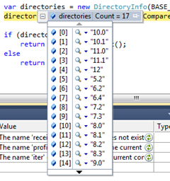
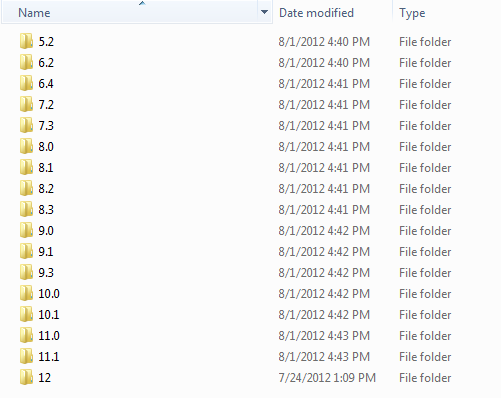

Here's the quick run down of the problem. Let's suppose you have a list of string that contain numeric values. When you sort 
that list in .Net they probably don't get returned in the manner you'd expect. They get returned based upon their ASCII string values 
giving you a list that looks something like the image below.<!--more--> This problem has already been [covered][1] [quite][2] [extensively][3] so 
I'm going to quickly run through the solution I ended up using.  



In order to sort this list into a format we expect we need a natural (logical, humanized or whatever you prefer to call it) type of 
sorting. After doing the quick "research" that brought you the above links, I noticed that explorer displayed my list of directories 
I have been trying to sort in the manner I desired.  



This led me to find a [post][4] on stackoverflow.com describing how to use a native Windows method - 
**StrCmpLogicalW(string psz1, string psz2)** - to do the type of comparison I desired. Native methods can be imported and easily 
wrapped up in some nice usable .NET! I have provided a link to this code for ease of use.  

[https://github.com/stesta/NaturalStringComparer][5] 

and the codez to use it...  

```csharp
var mylist = new List<string>();
mylist.Sort(new NaturalStringComparer());
```

[1]: http://www.codinghorror.com/blog/2007/12/sorting-for-humans-natural-sort-order.html
[2]: http://www.interact-sw.co.uk/iangblog/2007/12/13/natural-sorting
[3]: http://nedbatchelder.com/blog/200712.html#e20071211T054956
[4]: http://stackoverflow.com/questions/248603/natural-sort-order-in-c-sharp
[5]: https://github.com/stesta/NaturalStringComparer