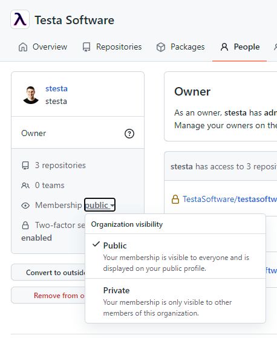
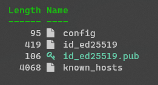
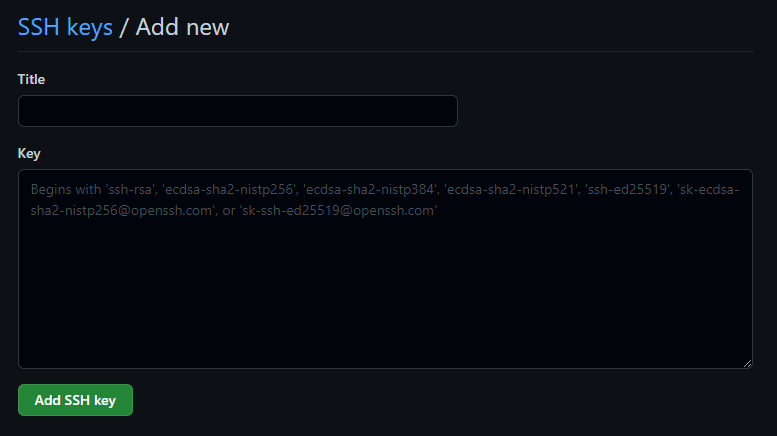
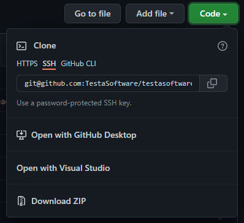

As a developer, a generally held principle is that you should be careful about mixing personal and professional facets of your life. Care needs to be taken in order to make sure things like intellectual property are protected on both sides. A lot of the time we can achieve that sort of care by making sure our professional lives are completely separate from our personal lives in terms of things like the projects we work on, the time we allocate, and even the hardware used. When it comes to GitHub, Some companies and enterprises might require the use of separate accounts. Make sure to double-check any existing policies. That being said, the generally recommended practice is actually **not to use multiple accounts**. It is the recommended practice to use a single GitHub account for all purposes.  

Using a single account for personal and professional purposes can make life a lot easier. It can provide a unified means to contribute to many different projects without having to switch accounts or manage multiple sets of credentials both in the browser and on the command line. Not to mention that using a single account means more green boxes! GitHub provides different ways to make the most of your account for all purposes. Armed with a little bit of information, you can make sure all your contributions to projects are recognized in the ways that you (and the organizations you contribute to) would like.

Organizations
-------------
One of the most important things you can do for yourself or your company is to make sure you're leveraging [GitHub Organizations][2]. Organizations provide a boundary for companies and organizations to facilitate collaboration while controlling access and security across many different repositories. Security and access permissions can be granted via roles under the organization.
 
Creating a new organization is straightforward. On the "Your Organizations" page there is a button for "New Organization". You will need to pick a plan. Free plans are available. Choosing a paid plan will get you things like more automation minutes and extra features like pages, wikis, and insights for private repositories. For open source repositories most features are already available on the free plan. Billing is per user in the organization. From there you will need to enter a little bit of information such as organization name and contact email. Once that form is completed you will be the proud owner of a brand new organization! 

### Organization Visibility  
As an individual, we can choose how we want to publicize the organizations we belong to. Navigate to the `People` tab of your organization, find your user (you can search for yourself if necessary), and click on your user. The page you land on will have an option regarding membership visibility. You may select public or private. Public makes your membership in this group visible to everyone and the organization will be displayed on your public profile. Private will mean that your membership is only visible to other members of the organization.  



Setting Your Email Address
--------------------------
You have probably already set up your global username and email address in git, but did you know you can set an email on an individual repository as well? Omitting the `--global` flag on the command saves the username and email local to the repository.

```bash
git config user.name "Steve Testa"
git config user.email "steve@testasoftware.com"
```

Setting an email on a specific repository will only affect your copy of the repository. After an email has been set then next time a `git commit` is issued it will use the more specific repository email over your globally set information. 

Another trick to make sure your contributions are recognized is to add additional emails to your profile in GitHub. Any additional emails you add will need to be confirmed, but once that is done all commits with that email will be recognized as one of your contributions. Adding an email to your profile can be done via GitHub Settings and choosing the Email tab in the left-hand navigation. On that page, an "Add email address" input can be found.  


 It is a good idea to keep your personal email address as your primary email. Any work or other emails associated with contributions can be added as secondary email addresses. Additional preferences can be specified including the decision to receive notifications only on the primary email address.  

SSH and GPG Keys
-----------------
Another nicety of using a single GitHub account is that you can use and manage multiple SSH and GPG keys. Multiple keys can always be generated, added, and removed if you no longer need them. 

While https is a perfectly secure option SSH keys can provide some extra comfort due to their larger key length and the private key being a piece of information that does not get shuffled around over the wire. 

To create a new SSH key you can use the following command. This command will generate your SSH key using the `Ed25519` algorithm. It was introduced in OpenSSH 6.5 and is compatible with GitHub. `Ed25519` is a preferred algorithm, but `RSA` can also be used assuming the key size is least 4096-bit length. Compared to `Ed25519`, `RSA` is slower and can be unsafe if the key is smaller than 2048-bit length. Additionally, `Ed25519` has the added benefit of being extremely compact weighing in at only 68 characters.

```bash
ssh-keygen -t ed25519 -C "your_email@example.com"
```

After you run the command you will be prompted to enter both the location (**it is recommended to just use the default directory**) to save key and an optional passphrase. What will actually be generated is an SSH key pair. Included in that pair is both a public key and private key. A public key can be shared freely and will not compromise your security or identity. A private key, however, needs to be kept secret. The optional passphrase mentioned earlier is an extra bit of encryption around the private key keeping it that much safer. The public key can be identified by the `.pub` extension.  



GitHub needs to know about your SSH key. To add your public key to GitHub go to your GitHub Settings and then SSH and GPG Key tab. You will find an button for "New Key". Enter a title so you can easily recognize the key that was generated and the Key will be the contents of your public key file. 



You can now clone a repo use the SSH link (or update your remotes on existing repositories). You can grab the SSH specific repository link via the clone dialog on GitHub. Git will recognize the default SSH directory and will automatically use your created SSH key to secure the communication. 



### GPG Keys 

- creating the GPG keyset 
- gpg signatures
  - kleopatra
- adding the GPG key to GitHub

### Signing a Commit 

Now that GitHub has a copy of your public GPG key, it can verify any commits signed with your private GPG key. Once the keyset exists, signing a commit becomes a relatively simple matter. One extra flag on the `git commit` command will do the trick.  

```bash
# use -S to create a signed commit
git commit -S -m "your commit message"
```

If you have more than one GPG key, however, Git needs to know which key to use. You can find additional documentation about this in the GitHub documentation for [Telling Git about your signing key][9]. Ultimately, once you figure out your key id, it can be added directly to your git global config.  

```bash
# list your gpg keys
gpg --list-secret-keys --keyid-format=long

# add the desired key to your git config
git config --global user.signingkey your-long-form-keyid-here
```

An X.509 key may also be used to sign commits. Please reference the above documentation for more information.  

Signing commits has the effect of marking that commit as "verified". This adds an additional layer of assurance and security as it asserts the commits were made by the individual listed. Repositories and Organizations can also be configured with additional security checks around verified commits.     

Personal Access Tokens
----------------------

When using GitHub with the command line or via the API, a personal access token (PATs) can be used in place of a password. 

- creating personal access tokens
- defining token permissions and expiration
- adding the PAT to the respository secrets

### Leveraging Bot Accounts

Part of the catch when using a personal access token is that permissions are defined by desired functionality and are not repository specific. Meaning, a personal access token that is granted read/write permissions would apply to all repositories and resources the owner of that token can access. This can present some problems when we're working with resources that aren't owned personally.  

A bot account can be a useful compromise and is a legitimate use-case in the [GitHub Terms of Service][10]. GitHub defines a bot account (which they refer to as a "machine account") like this in their terms:  

> A machine account is an Account set up by an individual human who accepts the Terms on behalf of the Account, provides a valid email address, and is responsible for its actions. A machine account is used exclusively for performing automated tasks. Multiple users may direct the actions of a machine account, but the owner of the Account is ultimately responsible for the machine's actions. You may maintain no more than one free machine account in addition to your free User Account.

A bot account can be created which has access to the desired resources. A PAT can be created on that bot account and used like normal. This ensures that any shared code (such as a GitHub action) cannot be used in a harmful way against unintended resources.  

### GitHub Token

There is a special access token named the `GITHUB_TOKEN`. When a workflow kicks off, GitHub will automatically create this token. The `GITHUB_TOKEN` can be used as a means of authentication inside of the workflow. The permissions are limited to the repository that contains the workflow, but this can be a useful and convenient alternative to creating PATs specifically for one workflow. See [Automatic token authentication][11] for more details.   

Notifications
-------------
- notifications

Leaving a Company
-----------------
- User Account
    - un-verify your company email address (delete the email address) and then re-add it without verifying to keep associated commits linked 
    - make sure your primary is your personal email
    - make sure your primary email is verified 
    - if your GitHub username has references to your old company/org you should change your GitHub username as well 
- Leaving Orgs
  - transfer ownership if you're the sole owner
  - remove yourself
  - if you own the org and someone leaves you can also remove them manually 
- open an issue or pr to keep contributions in your contributions graph

**Reference**: the main outline for this post was taken from this forum post: [lecoursen in GitHub Community][1] 

[1]: https://github.community/t/using-one-account-for-all-your-projects/10197 
[2]: https://docs.github.com/en/organizations/collaborating-with-groups-in-organizations/about-organizations
[3]: https://docs.github.com/en/account-and-profile/setting-up-and-managing-your-github-user-account/managing-user-account-settings/merging-multiple-user-accounts 
[4]: https://docs.github.com/en/account-and-profile/setting-up-and-managing-your-github-user-account/managing-your-membership-in-organizations/publicizing-or-hiding-organization-membership
[5]: https://docs.github.com/en/account-and-profile/setting-up-and-managing-your-github-user-account/managing-email-preferences/setting-your-commit-email-address#setting-your-email-address-for-a-single-repository
[6]: https://docs.github.com/en/account-and-profile/managing-subscriptions-and-notifications-on-github/setting-up-notifications/configuring-notifications#choosing-the-notification-delivery-method-for-organizations-you-belong-to 
[7]: https://docs.github.com/en/account-and-profile/setting-up-and-managing-your-github-user-account/managing-user-account-settings/best-practices-for-leaving-your-company 
[8]: https://docs.github.com/en/account-and-profile/setting-up-and-managing-your-github-profile/managing-contribution-graphs-on-your-profile/why-are-my-contributions-not-showing-up-on-my-profile#commits
[9]: https://docs.github.com/en/authentication/managing-commit-signature-verification/telling-git-about-your-signing-key
[10]: https://docs.github.com/en/github/site-policy/github-terms-of-service 
[11]: https://docs.github.com/en/actions/security-guides/automatic-token-authentication